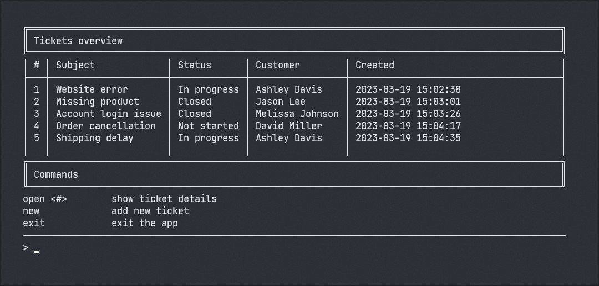
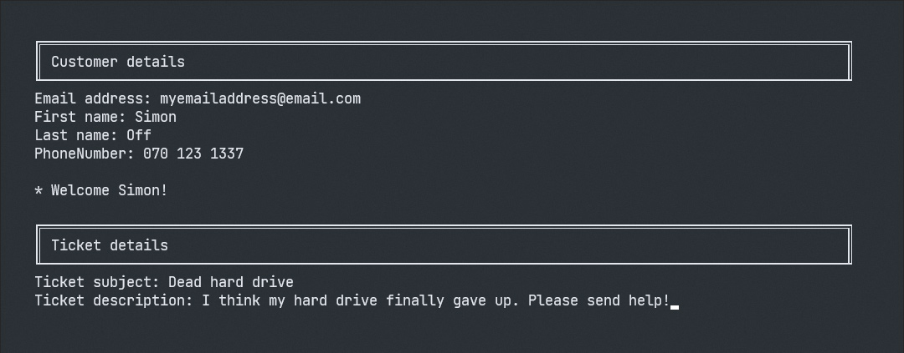
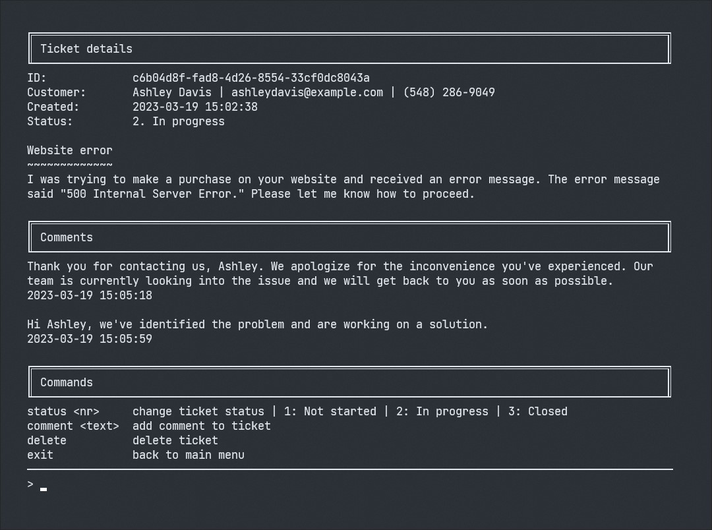

# **Issues Galore 📜✔**

Issue tracking app made with [.NET](https://dotnet.microsoft.com/en-us/) and [Entity Framework Core](https://learn.microsoft.com/en-us/ef/core/). Part of course submission for _introduction to data storage_ at _ECUtbildning 2023_.

---

## **About this app**

_- Issues Galore is a simple console application where you can add, edit, comment and solve customer support tickets_

The database schema is set up with Entity Framework using a code-first approach and the data is stored in a local SQL Server file: `issues_galore_db`. The application has simple CRUD functionality spread across three different views.

<br/>

### **TICKETS OVERVIEW**



This is the _tickets overview screen_, the home screen of the application, where you get a simple table overview of all the current tickets. If you enter the command `new`, you will navigate to the next view:

<br/>

### **NEW TICKET**



This is the _new ticket screen_ where you fill out the necessary customer and ticket details. After that, the ticket will be added to the database! If you enter an already used email address, then the app will recognize it as a recurring customer.

<br/>

### **TICKET DETAILS**



This is the _ticket details screen_. Here you can find all the details about a specific ticket. Open the ticket from the home screen by writing `open` followed by the number of the ticket you wish to see the details about. In this view, you can also add a new comment, change the status, or delete the ticket entirely.

<br/>

---

## **Running the app locally**

❗ Make sure you have the latest version of the [.NET sdk](https://dotnet.microsoft.com/en-us/download/dotnet) installed ❗

Clone this repo on your local machine:

```sh
$ git clone https://github.com/simon-off/issues-galore.git
$ cd IssuesGalore/IssuesGalore
```

Restore all the necessary NuGet dependencies:

```sh
$ dotnet restore
```

Update the `projectDirectory` field found in [DataContext.cs](/IssuesGalore/Context/DataContext.cs) and make sure the path points to your local project.

```csharp
// TODO: Update this string to your local project path
string projectDirectory = @"C:\YOUR_PATH_HERE\IssuesGalore\IssuesGalore";
```

Start your local app instance by running:

```sh
$ dotnet run
```

---

<br/>

Made with love and lots of [box-drawing characters](https://en.wikipedia.org/wiki/Box-drawing_character) by _[Simon](https://github.com/simon-off)_
